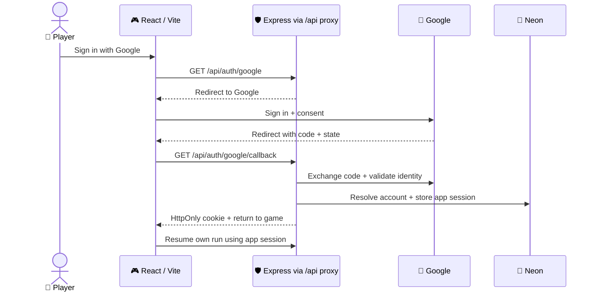

# 🔑 Authentication — Google OAuth

**Decision:** Google OAuth 2.0 + OpenID Connect. **Status:** planned MVP work. **Owner:** Di Heng.

React/Vite → Express → Google sign-in → app session in Neon. Guest play remains available.

## 🔄 Sign-in flow

## 🛡️ Identity and sessions

| | Contract |
|---|---|
| 🔑 Google | Backend authorization code flow; scopes `openid email profile`. Client secret and code exchange stay in Express. [Google web-server flow](https://developers.google.com/identity/protocols/oauth2/web-server) |
| ✅ Callback | Use a maintained OAuth/OIDC library. Bind short-lived, single-use state/nonce to the initiating browser with an HttpOnly flow cookie and a durable attempt record; reject mismatches and replay. Validate ID-token signature, issuer, audience, expiry and nonce. [Google OpenID Connect](https://developers.google.com/identity/openid-connect/openid-connect) |
| 👤 Account | Unique verified issuer + `sub` identify the Google account. Email/name are profile fields; an email change must not create a new owner. [Google identity claims](https://developers.google.com/identity/openid-connect/openid-connect#obtainuserinfo) |
| 🍪 App session | Random opaque session ID in a host-only `HttpOnly; Secure; SameSite=Lax; Path=/` cookie in deployed HTTPS environments. Store its hash, account ID and expiry in Neon; rotate on login and revoke on app sign-out. Local HTTP development may omit `Secure` only. |
| 🐘 Storage | Add dedicated game account/session/auth-attempt tables through additive Drizzle migrations. Retain legacy mission `players`/`sessions` tables. Sessions and attempts must survive serverless requests. |
| 💾 Private API | Validate the app session, then filter every save by owner and expected revision. Protect state-changing routes with an allowed-origin check and CSRF token. Return `401` for expired private access; keep pending local changes. |
| 📡 Scope | Google establishes identity at login. Subsequent saves use the app session; login needs no offline Google API access. |

## ☁️ Deployment contract

**Planned:** keep both Vercel projects. Forward frontend `/api/*` to the existing backend `/api/*`; use a Vite dev proxy locally. This gives browser requests a same-origin cookie path. Vercel supports [external rewrites](https://vercel.com/docs/routing/rewrites#rewrites-to-external-origins).

| | Setup / verification |
|---|---|
| 🌐 API base | Implement the frontend API-base change alongside auth. `VITE_API_URL` currently points directly at the API; it must resolve to the browser-facing proxy for the session flow. Verify cookie and `Set-Cookie` forwarding. |
| ↩️ Callback | Register exact `<frontend-origin>/api/auth/google/callback` URLs with Google: production, local development and one stable auth-test preview. Allowlist return destinations. Other previews remain guest-only unless explicitly registered and configured. |
| ⚙️ Backend config | Planned `GOOGLE_CLIENT_ID`, `GOOGLE_CLIENT_SECRET`, `GOOGLE_REDIRECT_URI`, `APP_ORIGIN`. Keep credentials server-side and retain existing database environment names. Configure consent audience/test users for the review cohort. |
| 🛡️ Origins | Retain direct-API CORS rules. Derive redirects from configured origins; trust forwarded headers only from a verified proxy. |
| 🚫 Cache | Auth/session/private-save responses use `Cache-Control: private, no-store` and CDN `no-store` headers; verify the proxy never shares them between players. |

## 📅 Delivery and acceptance

| Phase | Deliver |
|---|---|
| 2 · 🧱 Foundation | Google client/consent/callbacks, account/session schema, proxy and shared contracts. Guest opening stays independent. |
| 3 · 🔑 Working flow | New + returning Google sign-in, reload restoration, app sign-out, explicit guest-run attachment and cloud resume. |
| 5 · 🎮 Usability | Cancellation/error recovery, expired-session UI, save status and account-switch protection. |
| 8–9 · ✅ Release | Test callbacks, token rejection, expired/revoked sessions, CSRF, two-account isolation and deployed cookie/cache behavior. |

🔒 Preserve `nn.save.v1`, `nn.meta.v1`, `nn.analytics.v1` and legacy export. Sign-out/reset never erase them. Account switching never uploads another owner's local run.

📚 [Roadmap](DEVELOPMENT_ROADMAP.md#authentication-delivery-and-acceptance) · [Architecture](SYSTEM_ARCHITECTURE.md) · [Planned API routes](api.md) · [Testing](testing.md)
