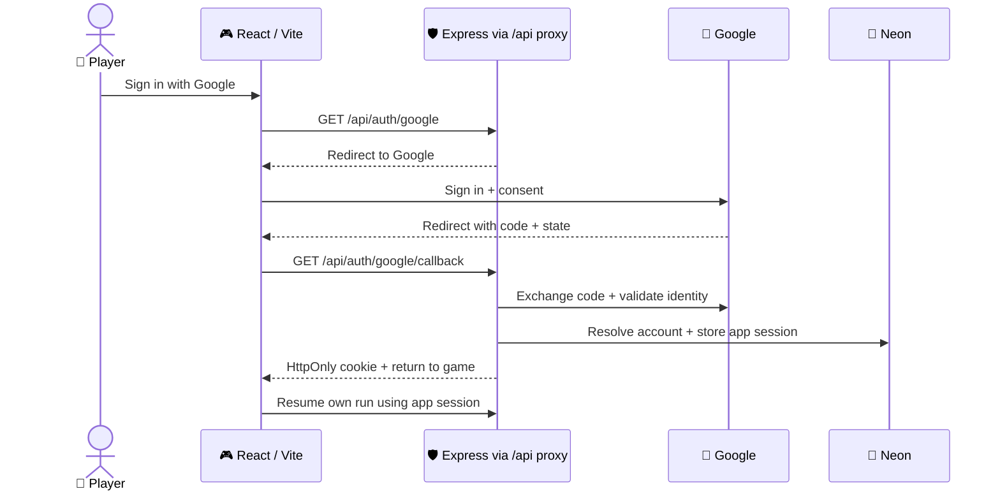

# 🔑 Authentication — Google OAuth

**Decision:** Google OAuth 2.0 + OpenID Connect. **Status:** implemented locally in the Phase 3 follow-up; Google/deployment configuration and live acceptance remain outstanding. **Owner:** Di Heng.

React/Vite → Express → Google sign-in → app session in Neon. Guest play remains available.

## 🔄 Sign-in flow

## 🛡️ Identity and sessions

| | Contract |
|---|---|
| 🔑 Google | Backend authorization code flow; scopes `openid email profile`. Client secret and code exchange stay in Express. [Google web-server flow](https://developers.google.com/identity/protocols/oauth2/web-server) |
| ✅ Callback | Use a maintained OAuth/OIDC library. Bind short-lived, single-use state/nonce to the initiating browser with an HttpOnly flow cookie and a durable attempt record; reject mismatches and replay. Validate ID-token signature, issuer, audience, expiry and nonce. [Google OpenID Connect](https://developers.google.com/identity/openid-connect/openid-connect) |
| 👤 Account | Unique verified issuer + `sub` identify the Google account. Email/name are profile fields; an email change must not create a new owner. [Google identity claims](https://developers.google.com/identity/openid-connect/openid-connect#obtainuserinfo) |
| 🍪 App session | Random opaque session ID in a host-only `HttpOnly; Secure; SameSite=Lax; Path=/` cookie in deployed HTTPS environments. Store its hash, account ID and expiry in Neon; rotate on login and revoke on app sign-out. Local HTTP development may omit `Secure` only. |
| 🐘 Storage | Add dedicated game account/session/auth-attempt tables through additive Drizzle migrations. Retain legacy mission `players`/`sessions` tables. Sessions and attempts must survive serverless requests. |
| 💾 Private API | Validate the app session, then filter every save by owner and expected revision. Protect state-changing routes with an allowed-origin check and CSRF token. Return `401` for expired private access; keep pending local changes. |
| 📡 Scope | Google establishes identity at login. Subsequent saves use the app session; login needs no offline Google API access. |

## ☁️ Deployment contract

Both Vercel projects are retained. `frontend/api/[...path].ts` forwards only the documented account/session/run paths to the HTTPS origin configured by the server-only `API_PROXY_TARGET`. There is no hard-coded production destination. Configure and verify destination ownership before enabling it. The proxy forwards separate Set-Cookie headers, redirects, cookies, Origin and CSRF, and disables caching. Local Vite `/api` requests forward to localhost:3001. Browser account requests always use `/api`; `VITE_API_URL` remains the independent health-client setting.

| | Setup / verification |
|---|---|
| 🌐 API base | Implement the frontend API-base change alongside auth. `VITE_API_URL` currently points directly at the API; it must resolve to the browser-facing proxy for the session flow. Verify cookie and `Set-Cookie` forwarding. |
| ↩️ Callback | Register exact `<frontend-origin>/api/auth/google/callback` URLs with Google: production, local development and one stable auth-test preview. Allowlist return destinations. Other previews remain guest-only unless explicitly registered and configured. |
| ⚙️ Backend config | Planned `GOOGLE_CLIENT_ID`, `GOOGLE_CLIENT_SECRET`, `GOOGLE_REDIRECT_URI`, `APP_ORIGIN`. Keep credentials server-side and retain existing database environment names. Configure consent audience/test users for the review cohort. |
| 🛡️ Origins | Retain direct-API CORS rules. Derive redirects from configured origins; trust forwarded headers only from a verified proxy. |
| 🚫 Cache | Auth/session/private-save responses use `Cache-Control: private, no-store` and CDN `no-store` headers; verify the proxy never shares them between players. |

## 📅 Delivery and acceptance

| Phase | Deliver |
|---|---|
| 2 · 🧱 Foundation | Google client/consent/callbacks, account/session schema, proxy and shared contracts. Guest opening stays independent. |
| 3 · 🔑 Working flow | New + returning Google sign-in, reload restoration, app sign-out, explicit guest-run attachment and cloud resume. |
| 5 · 🎮 Usability | Cancellation/error recovery, expired-session UI, save status and account-switch protection. |
| 8–9 · ✅ Release | Test callbacks, token rejection, expired/revoked sessions, CSRF, two-account isolation and deployed cookie/cache behavior. |

🔒 Preserve `nn.save.v1`, `nn.meta.v1`, `nn.analytics.v1` and legacy export. Sign-out/reset never erase them. Account switching never uploads another owner's local run.

📚 [Roadmap](DEVELOPMENT_ROADMAP.md#authentication-delivery-and-acceptance) · [Architecture](SYSTEM_ARCHITECTURE.md) · [Planned API routes](api.md) · [Testing](testing.md)

## Phase 2 implementation handoff — preparatory only

The approved Phase 2 scope defers working authentication, cloud saves and API proxy changes to Phase 3. The guest opening, local save and local telemetry export do not depend on Express. This is a scheduling adjustment to the earlier Phase 2 foundation table above, not removal of final-MVP authentication.

Extend the existing Express/Drizzle/Neon application with additive changes in Phase 3; retain legacy mission players/sessions. No schema, provider, routing or production migration was performed in Phase 2.

Proposed request/response contracts for Phase 3 review:

| Route | Request | Response / ownership |
|---|---|---|
| GET /api/auth/google | Allowlisted return destination | Backend-managed OIDC redirect; short-lived single-use state/nonce |
| GET /api/auth/google/callback | Provider code/state | Validate identity as above; durable app session and HttpOnly cookie |
| GET /api/session | Session cookie | Account ID/display name and CSRF token, or 401; no Google tokens |
| POST /api/auth/logout | Session cookie, CSRF/origin check | Revoke app session; retain local/legacy browser data |
| GET /api/runs/:runId | Session cookie | Owner-filtered envelope, revision and updatedAt; no cross-owner disclosure |
| PUT /api/runs/:runId | expectedRevision, versioned envelope | Atomic owner/revision-checked write; new revision, or 409 with explicit conflict information |
| POST /api/events | Bounded batch of attributed event envelopes | Accepted/duplicate event IDs; idempotent identity and owner attribution |

Use verified issuer + subject for account identity. Never trust a client-supplied account owner. Authenticate every private operation. Define an explicit guest-run attachment action; no automatic upload on sign-in or account switch. Keep local copies on network errors or revision conflicts. Schema validation must distinguish save schema version from scenario version.

The Phase 2 analytics bridge already supplies eventId, runId, sessionId, buildId, scenarioId/version, physicalStep, occurredAt and payload. Review batch size, retention and consent before remote ingestion. Server acknowledgements must not erase local unexported records prematurely.

Phase 3 acceptance: new/returning sign-in, cancellation, session restoration/sign-out/expiry, replayed callback rejection, CSRF/origin checks, atomic revision conflict, two-owner isolation, guest attachment, offline/local preservation, and deployed cookie/cache/proxy verification. Use Supertest/PGlite locally and isolated test credentials for external checks. Keep the current VITE_API_URL and two Vercel projects until that integration is implemented and tested.

## Phase 3 implementation and deployment checklist

See [the integration report](phases/PHASE_3_AUTH_CLOUD_REPORT.md) for validation and compatibility boundaries.

Implemented routes: GET `/api/auth/google`, GET `/api/auth/google/callback`, GET `/api/session`, POST `/api/auth/logout`, GET `/api/runs`, GET/PUT `/api/runs/:runId`. Remote analytics ingestion is still a separate Phase 4/backend deliverable. Accounts identify verified Google issuer/subject; the database stores hashes of app session tokens. State/nonce/PKCE attempts are durable, browser-bound and atomically consumed. OIDC uses openid-client with signature/non-repudiation checks enabled. Writes require the configured exact Origin and session CSRF token.

Cloud saves accept schema-3 and schema-4 compact replay envelopes; local Campaign now writes schema 4, including the optional historical foundation boundary. The frontend applies full simulation validation before loading. Deployed schema-1/2/3 local replay saves convert with exact source backups; Classic stays local. The API is not an anti-cheat engine. Uploads are limited to 1 MiB; oversized or incompatible saves remain local and exportable. No leaderboard/server-authoritative gameplay was added.

Configure the backend's GOOGLE_CLIENT_ID, GOOGLE_CLIENT_SECRET, GOOGLE_REDIRECT_URI and APP_ORIGIN for the same browser-facing origin; retain existing DATABASE_URL / DATABASE_URL_UNPOOLED and CORS_ORIGINS. Configure the frontend Vercel function's API_PROXY_TARGET to a verified HTTPS backend origin. Register the exact callback with Google and configure its consent/test audience. Unregistered previews must remain guest-only. Local HTTP cookies are permitted only for localhost/127.0.0.1; hosted cookies require HTTPS.

Before deployment acceptance: review/apply the additive migration through the authorized release process; verify two real Google accounts, cancellation, returning-user login, expiry/logout, callback replay rejection, cookie forwarding, private cache headers, fresh-browser resume, guest attachment, account switching and concurrent revision conflict. These live checks are not established by mocked provider/browser tests.

Sign-in never uploads a guest run automatically. Account bindings live under nn.campaign.cloud.v1 and survive sign-out. Pending owner snapshots remain local during errors/expiry; use Save company to cloud to retry. Conflicts require an explicit choice and retain both versions. Replacing an active company retains the original bytes/current snapshot; Export account copies includes preserved snapshots and conflict copies. Local storage quota failures are surfaced and cannot promise reload durability.
