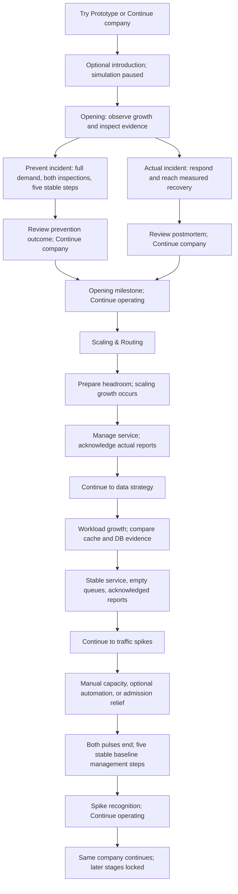

# Current game logic and player flow

Reviewed: 10 October 2026. Repository: `C:/Users/user/99.9-Percent`. Branch: `ai/phase-5-progression`. HEAD: `1322ebcdbade2fe4d1ec9fc34fb8bea652b6077a`.

This report describes the **current working-tree implementation**, including the uncommitted Phase 5 implementation, both Opening completion routes, progression guidance and prevention UX polish. It is not a description of HEAD alone, a production deployment, or a replacement phase contract. No production code was changed for this report.

## 1. What the game currently is

99.99% is a continuous company campaign about matching infrastructure to demand while managing cash. The player observes evidence, invests or limits admission, waits for real activation, measures recovery, and acknowledges reports before progressing.

It is **not only a database-overload game anymore**. The active campaign implements:

| Stage | Main learning question | New capability/context |
| --- | --- | --- |
| Opening | Which dependency is constraining service? | Database investment versus ineffective app addition versus traffic limiting |
| Scaling & Routing | Does installed capacity actually receive traffic? | Per-instance processing, larger apps, additional apps, load balancing and explicit routing |
| Data Strategy | How does workload change the value of a cache? | Read/write profiles, cold-cache warm-up, tuning and a larger database |
| Traffic Spikes & Autoscaling | Can delayed automation handle changing demand at an acceptable cost? | Two demand pulses, an optional controller, automatic installation/routing and safe retirement |
| Later stages | Not available in the active campaign | Reliability and combined-campaign/evaluation work remain later scope |

Opening can complete through recovered-incident acknowledgement or the new evidence-backed prevention outcome described in section 3. Both require explicit milestone acknowledgement.

The company keeps the same run ID, cash, architecture, queue state, pending work, trace and reports across stages. Starting a new company is a separate explicit reset.

The repository also retains older simulation, tutorial, research and incident code. Its presence does not mean those controls or incidents are active in the current campaign. `Game.tsx` selects the CampaignUI path when a campaign exists.

## 2. The normal player journey



This is a typical path, not a scripted sequence of guaranteed incidents. Preparatory investments or an admission limit can prevent later incidents. Reports are created only for actual recovered incidents.

### What the screen means

- **Campaign guidance:** current stage, desired outcome, factual prerequisites and continuation buttons.
- **Progression strip:** completed, current, available-next and locked stages, derived from existing campaign state.
- **System evidence:** incoming/admitted/rejected traffic; demand, capacity, busy utilisation, backlog, processed and failed work; latency and service errors.
- **Actions:** available investments, admission changes, routing and stage-specific controls; pending activation countdowns.
- **Office and dependency strip:** two views of the same infrastructure and selection. Selecting equipment does not create another simulation.
- **History/Menu:** read-only reports and trends, exports, onboarding replay, save/exit and confirmed new-company reset.

Try Prototype enters immediately as a guest. Continue company restores a saved company. The three-prompt introduction is skippable and separately persisted; it does not advance simulation time or reveal an incident solution.

Run starts the shared clock; Pause freezes physical work. Advance step is available in management. During an active incident, use Run/Pause to observe consequences; the current UI disables Advance step there. Speed controls change real-time pacing, not the amount of work modeled by one physical step.

The first incident auto-pauses. Recovery, pending Opening recognition, pending spike recognition and bankruptcy stop advancement. Opening dialogs may be dismissed without acknowledgement and reopened from guidance. Menu opening pauses play; hiding the browser tab pauses play, with no automatic offline catch-up. History itself is not a universal pause command: pause explicitly when inspecting a live management/incident run.

## 3. Opening: diagnosis and explicit completion

The initial company has $20,000, one 1,000 req/s application, one 600 ops/s database, and 300 incoming req/s. The displayed user count is 2,000; campaign demand is controlled by traffic events rather than a fully modeled customer-growth system.

At physical step 4, incoming demand becomes 800 req/s. Without intervention, the database receives more work than its capacity while the application retains headroom. Three overloaded database steps open the first incident at step 6.

Opening choices are free inspection, app addition, database upgrade and traffic limit/removal. Adding an app installs capacity but leaves it unrouted. It neither increases database capacity nor automatically shares traffic. An upgrade activates after its delay; a limit admits at most 500 req/s and rejects the rest.

The reactive completion chain is:

| Event | Authoritative state / player action |
| --- | --- |
| Incident recovered | Five consecutive qualifying measurements; engine records recovery, creates a causal report, clears the incident, sets `openingRecovered=true` and `phase="review"` |
| Review pending | Guidance says Incident recovered and offers **Review postmortem**; the report also opens automatically |
| Report acknowledged | **Continue company** invokes `acknowledge_review`; records `review-acknowledged`, returns to management and awards the first report's Opening milestone if absent |
| Milestone pending | `openingMilestone.acknowledged=false`; guidance offers **Complete Opening**, which opens the existing milestone dialog |
| Opening completed | Milestone **Continue operating** invokes `acknowledge_milestone`; marks it acknowledged and enters Scaling & Routing |

Closing a dialog or pressing Escape does not perform either acknowledgement. The milestone grants no cash, research or extra traffic. No physical step is consumed by these acknowledgements.

### Prevention completion route (10 October update)

Opening also supports a distinct preventive route, authorized after diagnosis of the healthy-company soft-lock. The reactive incident/recovery route above is unchanged.

Once Opening growth is consumed, a company with no Opening incident ever opened can qualify by serving the full 800 req/s without a traffic limit or rejection, with positive cash, empty application/database queues, latency <500 ms and service errors <1%. Application and Database must each be explicitly inspected after growth. Five consecutive **new** physical steps must satisfy all requirements after those inspections. Any failing step resets the streak. Reading, inspection, pause, reload and acknowledgements add no observations.

Optional `campaign.openingPrevention` records eligibility step, the two inspection steps, stable streak and a distinct outcome containing the five recorded snapshots, previous rejected demand and setup spending. Existing schema-5 saves without this field remain loadable and start with no credited inspections or observations. No historical progress is backfilled.

Qualification pauses physical advancement without setting `openingRecovered=true` or creating an incident report. Guidance exposes **Review outcome**, opening **Prevention review**. **Continue company** invokes `acknowledge_prevention_review`, acknowledges that outcome and awards the same `opening-stability` milestone with prevention provenance (`incidentId=null`, `outcomeId="opening-prevention"`). **Complete Opening** reopens the milestone if dismissed; **Continue operating** uses the existing `acknowledge_milestone` and `enterScaling` transition. No cash/research reward or physical step is consumed.

The compact **FIRST GROWTH** checklist shows Serve the full 800 req/s, Inspect the Application, Inspect the Database and **Stable service: n / 5 seconds**. Unmet cash, queue or health requirements remain visible. Once the outcome exists, **FIRST GROWTH PREVENTED** and **Review outcome** are shown. The review uses What happened / What you prepared / What the evidence showed / Trade-offs / Outcome, with actual recorded actions, costs, rejection and capacity evidence. Traffic limiting can keep the system technically healthy while blocking this completion route. History includes the distinct prevention outcome; it is never called an incident postmortem. All state survives paused resume. Actual incidents in subsequent stages still use normal recovery/reports; they do not award Opening again.

## 4. Scaling & Routing: effective capacity

Opening milestone acknowledgement initializes `application-scaling` v1 and exposes scaling/routing controls. This is distinct from triggering its next growth event.

Growth scheduling requires management, no active incident, empty app/database backlogs and an explicitly purchased database capacity of at least 2,000 ops/s. The first ready step schedules growth three steps later; readiness must still hold when the event applies. Incoming demand becomes 1,400 req/s once.

One base application can process 1,000 req/s, so the application can now be constrained even though the database has headroom. Available responses include increasing an application's capacity to 1,600 req/s or installing another application and configuring load-balanced routing.

Deployment and routing are separate. Deploying a load balancer does not change the route. A new app receives no fresh work until routing includes it. Unrouted apps still incur upkeep and drain their own existing queues, if any.

Balanced routing splits integer demand equally among selected IDs in numeric order. It does not weight allocations by capacity: a mixed 1,600/1,000 pool can overload its smaller app even when aggregate installed capacity looks sufficient. The UI offers all-app balancing, individual balanced targets and the original App 1 route.

**Continue to data strategy** becomes available after scaling growth has been consumed, management is resumed, every app/database queue is empty, no incident is active and all actual reports are acknowledged. Entering Data marks Scaling completed in the progression strip. Merely deploying a load balancer does not complete the stage.

## 5. Data Strategy: workload and cache effectiveness

Explicit continuation initializes `data-strategy` v1. Normal play selects a read-heavy or write-heavy profile deterministically through the saved RNG; it is not guaranteed to start read-heavy. Evaluation fixtures may specify a profile.

When readiness holds, growth is scheduled three steps later and increases incoming traffic to 2,400 req/s. The gate does not guarantee sufficient application capacity: poor preparation can expose both app and database constraints.

Read-heavy work is 80% reads/20% writes; write-heavy is 20% reads/80% writes. Classification happens after application processing. All reads in the current profiles are cache-eligible; writes always require database processing.

A cache starts cold, uses its current hit rate for the current step, then warms by 12 percentage points for the next step when eligible reads were processed. Its initial ceiling is 60%; tuning raises the ceiling to 75%, with further warm-up required. The cache is a deterministic hit-rate model, not a simulated collection of stored keys or a separate capacity-limited queue.

For each step:

- Reads are the floored profile share of application-processed work; remaining work is writes.
- Hits are the floored eligible-read count multiplied by the current hit rate.
- Misses and writes reach the database; cache hits count as successful responses without DB work.

Example at 2,400 app-processed requests and a warm 60% cache: read-heavy creates 1,152 hits and 1,248 new DB operations; write-heavy creates 288 hits and 2,112 new DB operations. This is why identical cache settings can have different outcomes. Existing DB backlog still needs processing.

A 3,000 ops/s database is the other major data-layer response. **Observe contrasting workload** switches the profile once when data growth is consumed, management is ready and reports/queues permit it. This contrast is optional, and becomes unavailable after entry to spikes.

## 6. Traffic Spikes & Autoscaling: delayed capacity

**Continue to traffic spikes** requires consumed data growth, positive cash, stable management, empty queues, acknowledged Opening milestone and all reports. It does not require buying a cache, buying automation or performing the optional contrast.

Entry creates `traffic-spikes` v1, preserves the company and grants one forward research point. Spending it unlocks the existing autoscaling technology identity; deployment is a separate paid action. No tenth tech node or general research tree is added.

For entry at physical step `n`:

| Interval | Incoming demand |
| --- | ---: |
| Before `n+8` | 2,400 req/s |
| `[n+8, n+28)` | 4,000 req/s |
| `[n+28, n+48)` | 2,400 req/s |
| `[n+48, n+68)` | 4,000 req/s |
| From `n+68` onward | 2,400 req/s |

These boundaries are saved physical deadlines. Pausing or reload does not rebase them. Incidents are still measured outcomes, not forced pulse events.

The optional controller requires unlock, deployed load balancing, balanced routing to at least two apps, a free infrastructure slot and sufficient cash. It observes routed processed work divided by routed capacity:

- Strictly above 80% for three fresh observations: request one base app.
- Automatic installation takes three steps, followed by a one-step routing change. Useful capacity arrives no earlier than request +4.
- Strictly below 60% for six safe observations: request retirement of an eligible controller-created base app.
- Maximum installed apps is four in this stage; retirement must leave at least two installed/routed apps.
- Cooldown is four steps after joining/retirement. Blocking and pending joins reset observation streaks.
- Retirement requires stable service, empty queues, no active incident and safe remaining per-instance allocations. It rechecks the next-step demand/admission state before removing the app.

Manual installations retain their two-step delay. Only eligible controller-created base apps can retire; manually installed or vertically upgraded apps are protected. There is no setup refund. Manual routing changes can leave a paid auto-created app installed but unrouted if the expected routing pool changed.

Disabling the controller stops new decisions; already accepted work is not rolled back. Installed controller upkeep continues while disabled. Automation cannot expand the database, improve cache effectiveness or remove an admission limit.

After both pulses end, five qualifying baseline management steps with empty queues and acknowledged reports record stage completion. The recognition then requires **Continue operating**. It grants no further resources, preserves the company and generates no additional pulses. The strip labels the stage Completed after acknowledgement, while guidance remains in the Traffic Spikes & Autoscaling context; Reliability stays locked.

## 7. Shared simulation and incident rules

One physical step models one second of requests. Each app processes `min(previous backlog + new demand, capacity)`. Remaining work is queued up to 1,000 per app; overflow fails. The database applies the same rule with a 600-operation backlog limit, even at higher capacity tiers.

Database demand comes from app-processed work, minus cache hits when the data workload is active. Queue drainage can therefore send work downstream after its original arrival step.

Latency is the gameplay approximation:

```text
100 ms + 1,000 × (largest per-instance backlog/capacity + DB backlog/capacity)
```

Service error rate is failed outcomes divided by successful plus failed outcomes. Deliberate admission rejections are displayed separately and are not service errors.

Each component has its own overload streak. Demand strictly above that component's capacity for three consecutive steps opens an incident. Multiple simultaneously qualifying components are recorded; numeric app order then DB determines the primary component.

Recovery requires five consecutive observations with latency strictly below 500 ms, service errors strictly below 1%, positive admissions and completed outcomes. An unhealthy measurement resets the streak. Clicking an investment, finishing deployment or waiting for a timeout is not itself recovery.

Postmortems use recorded snapshots, trace and actual action activations. They explain ineffective installation, useful routing/capacity, cache effects, admission trade-offs and delayed automation. They are not AI-generated answers. Bankruptcy is checked after settlement and takes precedence over recovery on that step.

## 8. Economy and the traffic-limit trade-off

Purchases deduct cash immediately; operating exposure starts when infrastructure activates. One infrastructure deployment is allowed pending at a time, with admission/routing using their existing separate constraints. Purchases must leave positive cash.

| Investment | Setup | Activation delay | Upkeep per full 60-step period |
| --- | ---: | ---: | ---: |
| Additional base app | $1,000 | 2 manual / 3 automatic | $700 |
| Scale existing app to 1,600 | $2,000 | 3 | $1,100 total for that app |
| DB 600 → 1,000 | $3,000 | 3 | $1,500 total DB upkeep |
| DB 1,000 → 2,000 | $3,000 | 3 | $2,500 total DB upkeep |
| DB 2,000 → 3,000 | $4,000 | 4 | $3,500 total DB upkeep |
| Load balancer | $1,000 | 2 | $300 |
| Read cache | $1,500 | 2 | $400 |
| Cache tuning | $1,000 | 2 | No separate extra upkeep |
| Autoscaling controller | $1,000 | 2 | $100, including disabled periods |
| Traffic limit/removal | $0 | 1 | No separate upkeep |

The initial database costs $500 per full period. Four fixed engineers cost $1,600 each, or $6,400 total per full period. Salaries and installed idle infrastructure still count.

Every 60 physical steps settles one operating week: successful requests earn $0.20 each, and accrued infrastructure/salary exposure is charged. Integer remainders preserve partial-period cents; settlement is exactly once. Pending revenue is not spendable cash before settlement.

Traffic limiting always caps admission at 500 req/s, including in later stages. At 800 incoming, that means 500 admitted and 300 rejected. Rejected demand earns no revenue. Its displayed opportunity value is rejected count × $0.20; it is **not an extra cash charge**.

For illustration only, a complete unchanged 800 req/s period with one base app and a 1,000 ops/s DB yields $9,600 revenue and $8,600 operating costs, before purchases. Limiting the same system to 500 gives $6,000 revenue against the same costs. Actual mixed periods depend on activation timing, failures, queues and other infrastructure.

Thus **Stable — traffic limited** can be technically successful and financially weak. Long pauses cost no physical upkeep, but leaving Run enabled continues settlement exposure. Insolvency ends the run, explains settlement, preserves evidence and offers explicit confirmed restart.

## 9. Persistence, measurement and boundaries

The optional prevention extension stays in schema 5; old saves are not rewritten merely to initialize it. Updated validation accepts both absent extensions and evidence-backed prevention milestones. Builds predating this feature do not support the new prevention milestone format; export the company before any rollback.

Campaign saves use envelope schema 6 at `nn.campaign.save.v1`, with separately stored onboarding metadata and local analytics.
A save holds the seed and the recorded player inputs; loading replays them on the deterministic engine, so older schemas 1-5 load through the same replay.
An older schema cannot contain decisions introduced after it, and before replacing an older save its exact bytes are backed up.
Legacy `nn.save.v1`, `nn.meta.v1` and `nn.analytics.v1` remain separate.

Autosave runs through existing transitions and a ten-second foreground timer, with page lifecycle saves. Resume is paused and preserves pending action deadlines, queues, progression, acknowledgements and measurement. Corrupt/unsupported saves are protected and exportable; unavailable storage cannot guarantee durable reload recovery.

Local telemetry attributes run/session/build/scenario, physical step, timestamps and active time. Stable trace IDs distinguish requests from activations and player actions from controller actions. Continuing the same run is not replay. Menu offers session/campaign/legacy exports and manually recorded observer context. The gameplay flow does not require the API, Google sign-in or cloud saves. Deferred auth/cloud drafts remain outside this active flow.

Nine technology identities are retained, but the full legacy research UI is not the active progression mechanism. Active reliability actions such as injected app failures, health checks, spare promotion and failover are not implemented in this campaign.

## 10. What is verified and what is not

Fresh final validation under Node 22.23.3 passed 340 unit tests with one optional TRACE skip, eight balance tests and all 23 CI desktop/mobile E2E journeys in one run without retries. Lint passed with 23 unchanged warnings; typecheck, coverage, production build and whitespace checks passed. Backend lint/typecheck/coverage passed with 18 tests and no lint warnings.

Frontend coverage: 83.89% statements, 80.42% branches, 88.44% functions and 86.47% lines; visual components are outside its configured scope. Both Opening routes and paused reload at inspection/streak/review/milestone/completed states passed. Full Phase 1–5 regressions passed, including guest play with the API unavailable. See the final-validation section of the [Phase 5 implementation report](phases/PHASE_5_IMPLEMENTATION_REPORT.md) for exact commands and boundaries.

Deployment and human sessions remain NOT TESTED. These checks do not prove enjoyment, learning, session duration, real-device accessibility or profitability for every inherited company. The known solvent Scaling affordability trap remains; section 12 explains why visible guidance is not a universal financial rescue. The working changes remain uncommitted and deferred auth/cloud remains unapplied. No gameplay was changed during this final validation/documentation pass; Phase 6 was not started.

## 11. Source map

| Concern | Actual implementation |
| --- | --- |
| Active shell/clock | [Game.tsx](../frontend/src/components/Game.tsx) |
| Guidance, evidence, actions and report/milestone UI | [CampaignUI.tsx](../frontend/src/components/CampaignUI.tsx) |
| Derived stage blockers and pending actions | [campaignGuidance.ts](../frontend/src/game/campaignGuidance.ts) |
| Room/component selection | [Facility.tsx](../frontend/src/components/scene/Facility.tsx) |
| Lifecycle, pause, actions and local resume | [store.ts](../frontend/src/game/store.ts) |
| Physical processing, routing, incident/recovery and continuations | [step.ts](../frontend/src/sim/step.ts) |
| Stage constants | [Opening](../frontend/src/sim/scenarios/openingDatabaseIncident.ts), [Scaling](../frontend/src/sim/scenarios/applicationScaling.ts), [Data](../frontend/src/sim/scenarios/dataStrategy.ts), [Spikes](../frontend/src/sim/scenarios/trafficSpikes.ts) |
| Controller/pulses and spike completion | [autoscaling.ts](../frontend/src/sim/autoscaling.ts) |
| Cash settlement/exposure | [settlement.ts](../frontend/src/sim/settlement.ts) |
| Causal reports | [trace.ts](../frontend/src/sim/trace.ts) |
| Save/metadata/export and migrations | [persist.ts](../frontend/src/game/persist.ts), [saveEnvelope.ts](../frontend/src/game/saveEnvelope.ts), [replay.ts](../frontend/src/sim/replay.ts) |
| Opening prevention eligibility, observations and outcome | [openingPrevention.ts](../frontend/src/sim/openingPrevention.ts) |
| Local event measurement | [telemetry.ts](../frontend/src/game/telemetry.ts) |
| Existing tech identities/gating | [tech.ts](../frontend/src/sim/tech.ts) |

## 12. Campaign-wide progression guidance update

The existing Campaign guidance now uses one unsaved, read-only `campaignGuidance` model to show completed/incomplete requirements, waiting states and pending explicit actions. It preserves both Opening routes and every existing Scaling/Data/Spike gate. Required reviews, milestones and continuations remain outside History; pending spike recognition can also be dismissed and reopened without acknowledgement. Growth waiting text does not disclose future scheduled steps. Workload contrast and autoscaling are explicitly optional. Reliability is explicitly unimplemented.

Traffic limiting explains why Opening prevention cannot qualify at full demand. Scaling also explains unaffordable mandatory headroom without promising a financial rescue. A reproduced supported purchase sequence can remain solvent but unable to fund headroom and earn positive net revenue; resolving that economic dead end would require a separately approved balance/progression change. This guidance pass makes the cause visible without changing mechanics or repairing saved state.

See [Campaign progression guardrail report](CAMPAIGN_PROGRESSION_GUARDRAIL_REPORT.md) for the changed-file list, exact gates, the historical guardrail run and the fresh final validation: 340 passing unit tests/one optional skip, eight balance tests and 23 full-suite browser journeys. These are local automated results, not deployment or human acceptance.

## Opening progression guardrail

Previously, preventing every Opening incident left a healthy company unable to produce the recovered-incident report required for progression. The authorized preventive route resolves that dead end without inventing an incident or automatically completing Opening.

- **Reactive:** actual incident → five measured recovery steps → Review postmortem → Continue company → explicit milestone acknowledgement → same-company Scaling.
- **Preventive:** consumed growth, no incident, positive cash, full 800 req/s service without limiting/rejection, empty queues, healthy completed outcomes and both post-growth inspections → five consecutive new stable steps → Review outcome / Prevention review → Continue company → the same explicit milestone acknowledgement → Scaling.

Campaign guidance exposes real stage-blocking conditions and pending reviews/recognitions outside History. It explains waiting without exposing future event deadlines and leaves optional strategies and valid interventions available. The prevention checklist uses player-facing service/inspection labels, a live five-second simulated-service counter and an explicit traffic-limit consequence. Review sections describe actual preparation, recorded capacity evidence, spending and rejected demand; they do not claim optimal spending or zero trade-offs.

No simulation equations, balance constants, prices, settlement rules, incident/recovery thresholds or Phase 2–5 stage gates changed for the guardrail or UX polish. The earlier authorized prevention implementation adds a completion route and an optional schema-5 state extension; the presentation pass adds no progression/store/save semantics. The financial affordability trap described in final validation remains a separate known limitation.
