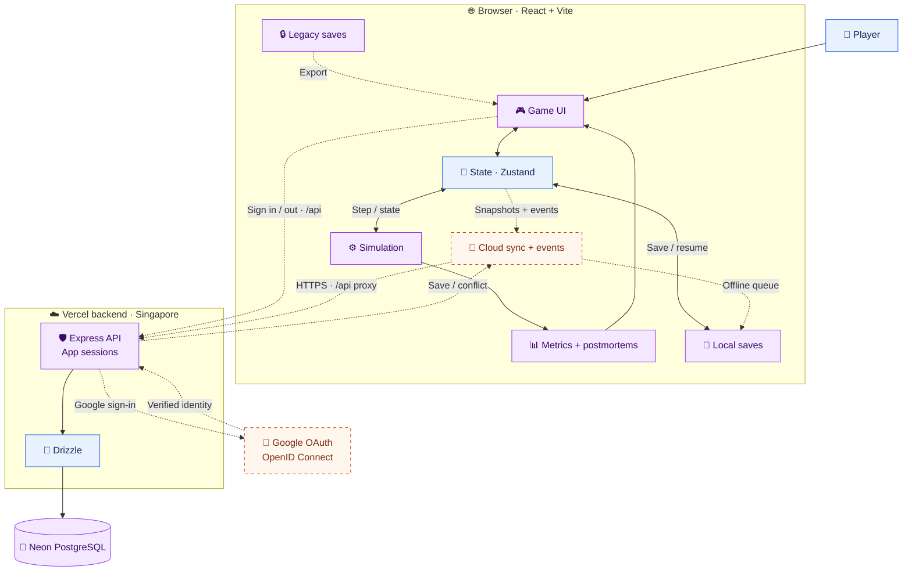
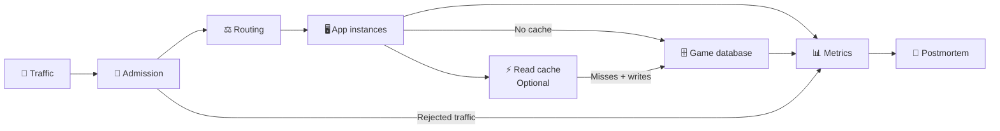

# 🏗️ System Architecture — 99.99%

**Target MVP** · React/Vite + Express + Drizzle + Neon · [Full roadmap](DEVELOPMENT_ROADMAP.md)

**Legend:** 🔵 Existing · 🟣 Extend existing · 🟠 Planned · Dashed arrows = planned connections.

## 🌐 The real app

🆕 Google OAuth, app sessions, cloud saves and centralized analytics are planned. 🛠️ The 2D UI and shared simulation extend the prototype. [🔑 Auth flow](AUTHENTICATION.md)

| | Lives here | Handles |
|---|---|---|
| 🎮 UI | [components](../frontend/src/components/) | Controls + dashboards |
| 🧭 State + saves | [game](../frontend/src/game/) | One company + local persistence |
| ⚙️ Simulation | [sim](../frontend/src/sim/) | Seeded steps + incidents + reports |
| 🛡️ API | [backend](../backend/src/) | Identity + ownership + validation |
| 🐘 Storage | [db](../backend/src/db/) · [migrations](../backend/drizzle/) | Accounts + saves + events |

## 🎮 Infrastructure inside the game

**Simulated in the browser** — these are game objects, separate from the real API and Neon database.

- ⚖️ More app instances need routing; they do not increase database capacity.
- ⚡ Caching reduces eligible reads; workload and warm-up matter.
- 🩺 Failover reroutes traffic; surviving capacity still matters.

## 📌 Rules to keep

| | Rule |
|---|---|
| ⚙️ Gameplay | Pure, seeded browser simulation. UI reads its results; the backend stores data. |
| 🔑 Accounts | Google sign-in + app sessions. Guest play stays available; the API verifies save ownership. |
| 💾 New saves | Separate storage namespace. Atomic owner + revision checks; conflicts retain local copies. |
| 🔒 Old saves | Keep `nn.save.v1`, `nn.meta.v1`, `nn.analytics.v1` intact and exportable, including on reset/logout. |
| 📡 Requests | Bound snapshots/events to the current 1 MB limit; queue while offline and deduplicate events. |
| 🛡️ Secrets | Database/auth secrets stay server-side. Planned same-origin `/api` proxy + HttpOnly session cookie. |
| ☁️ Deployment | Keep both Vercel projects and Neon. Additive Drizzle migrations; existing CI/CD stays. |

📚 Details: [roadmap](DEVELOPMENT_ROADMAP.md) · [testing](testing.md) · [setup](../README.md)
