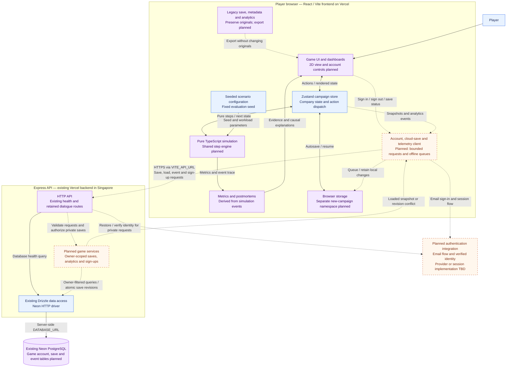
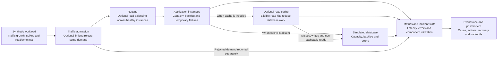

# System Architecture — 99.99%

This document visualises the **target MVP** in the [Development Roadmap](DEVELOPMENT_ROADMAP.md), using the existing React/Vite frontend, Express API, Drizzle, Neon, and two Vercel deployments. It describes application architecture and the simulated infrastructure inside the game separately.

**Status:** the game, deterministic simulation modules, Zustand store, browser persistence, Express health routes, and Neon connection already exist. The shared simulation-step redesign, 2D view, authentication, cloud saves, and centralized analytics are planned work. The diagrams are design guidance, not a claim that those integrations are implemented.

## 1. Application and deployment architecture

Solid connections show existing relationships. Dashed connections show planned integrations. Blue boxes are existing foundations, purple boxes extend existing components, and amber boxes are new work; labels also identify the planned parts.

The authentication box is a logical responsibility, not a decision to provision another service. Phase 2 selects either a compatible provider integration or a backend session implementation. The browser/API session transport and callback origins follow that choice. Both retain Neon as the application database.

### Responsibilities and boundaries

| Component | Responsibility | Repository location |
|---|---|---|
| Game UI | Architecture interaction, metrics, onboarding, progression, account/save controls. | [`frontend/src/components/`](../frontend/src/components/) |
| Campaign store | Dispatch actions, manage the active company, expose renderable state, coordinate saving. | [`frontend/src/game/store.ts`](../frontend/src/game/store.ts) |
| Simulation | Deterministic traffic, capacity, backlog, costs, action delays, failures, recovery, progression and traces. | [`frontend/src/sim/`](../frontend/src/sim/) |
| Local persistence | Guest play, autosave/resume, separate storage versions, retained legacy data. | [`frontend/src/game/persist.ts`](../frontend/src/game/persist.ts) |
| Frontend API client | Health now; planned authentication integration, save/load and event submission. | [`frontend/src/lib/api.ts`](../frontend/src/lib/api.ts) |
| Express API | Validate inputs, verify identity, authorize private saves, accept public guest events/sign-ups. | [`backend/src/app.ts`](../backend/src/app.ts), [`backend/src/routes/`](../backend/src/routes/) |
| Drizzle / Neon | Accounts, saved snapshots, revisions, event deduplication and sign-ups through new migrations. | [`backend/src/db/`](../backend/src/db/), [`backend/drizzle/`](../backend/drizzle/) |
| Shared contracts | Agree save envelopes and API request/response types across frontend and backend. | [`shared/`](../shared/) — game-specific contracts to add |

The simulation represents imaginary infrastructure; it does not provision servers. It remains independent of React, storage, authentication and network calls. The UI renders its outputs rather than calculating separate outcomes. Backend services store player data and events; they do not advance the game or determine incident recovery.

## 2. Infrastructure simulated inside the game

Everything below runs as simplified TypeScript calculations in the player's browser. These application instances, caches, load balancers and databases are **game components**, separate from the real Express/Neon hosting above.

- Capacity overload emerges from demand, processing limits and bounded backlog. It can affect the application or database.
- Temporary application failure interacts with health detection, routing and remaining capacity. Failover reroutes work; it does not create capacity.
- A database overload persists until the modeled metrics recover. Adding application instances does not increase database capacity.
- Health checks, spare capacity, upgrades and autoscaling change component behaviour through the shared step engine. They are gradually unlocked choices, not additional real cloud services.

## 3. Main data flows

1. **Play and recover:** a UI action reaches the store, which calls the pure simulation transition. The returned campaign state, metrics and trace drive the UI, local autosave and postmortem. The same company continues after recovery.
2. **Authenticate and attach a guest run:** the player explicitly signs in, the API verifies their identity, and the selected new-format guest run is associated with that owner. Keep its company/run ID. Switching accounts never silently reassigns another owner's run.
3. **Cloud save and resume:** send a bounded, versioned snapshot and expected revision through the API. One database update matches the save ID, verified owner and expected revision; it increments revision atomically. A stale revision produces a conflict, preserving the local copy. Resume restores the same campaign and pending state.
4. **Observe and evaluate:** queue bounded analytics events with unique IDs and run/build/scenario attribution. The API validates and deduplicates them in Neon. Preserve the fixed evaluation build and seed; report organic and recruited results separately.
5. **Preserve old saves:** leave `nn.save.v1`, `nn.meta.v1` and `nn.analytics.v1` intact. New storage uses a separate namespace. Export old saves without passing them through the new loader; reset and sign-out must not delete them. Conversion is outside the MVP.

## 4. Deployment and implementation constraints

- Keep the two existing Vercel projects: the static Vite frontend and Express backend. The backend stays in `sin1`, alongside the configured Singapore Neon database.
- Only public frontend configuration such as `VITE_API_URL` belongs in the browser. Database credentials and authentication secrets stay server-side. CORS config allows the relevant frontend production/preview origins; authorization separately protects private saves.
- Keep `DATABASE_URL` for runtime queries and `DATABASE_URL_UNPOOLED` for migrations. New game tables use additive Drizzle migrations. The existing language-learning tables and routes remain legacy contracts until separately retired.
- Request bodies currently have a 1 MB limit. Bound snapshots and event batches; keep detailed histories from growing every autosave request indefinitely. Network or authentication failure preserves local progress.
- The existing GitHub Actions checks cover both packages, browser journeys and migration consistency. Merges to `main` trigger Vercel deployment and the production migration workflow; schema changes must be backward-compatible because those processes overlap.
- Guest play requires no account. Authentication and owner-scoped cloud saves are final-MVP requirements, delivered through the [roadmap's authentication milestones](DEVELOPMENT_ROADMAP.md#authentication-delivery-and-acceptance).

For current tests and deployment details, see [testing](testing.md), [prototype migration](prototype-migration.md), and the [README](../README.md). This document adds no runtime integration, infrastructure provisioning or schema migration.
