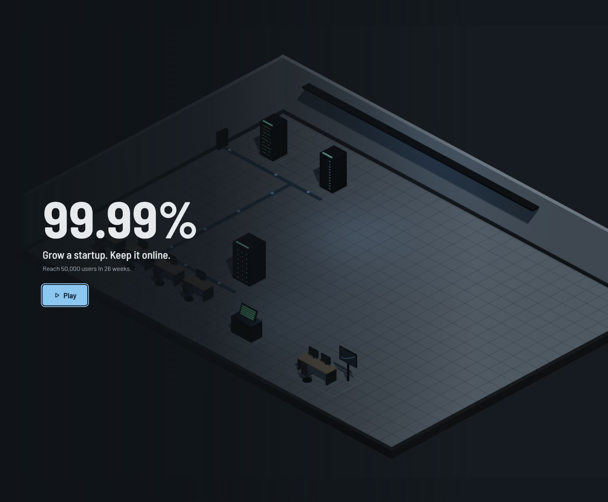
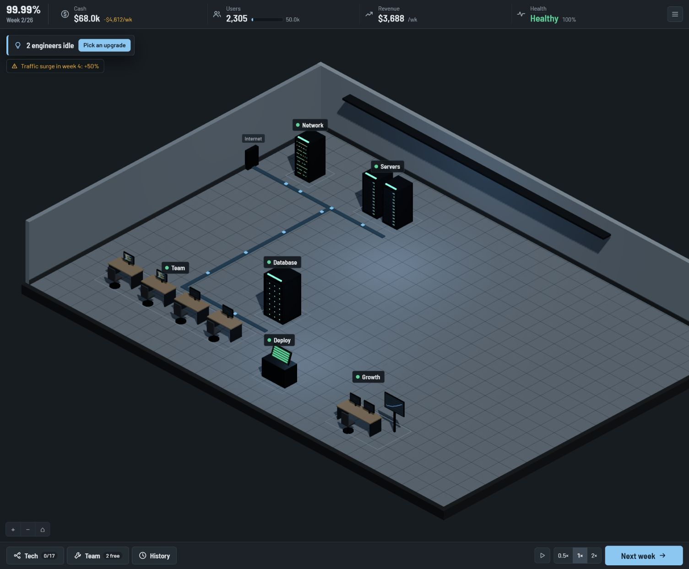
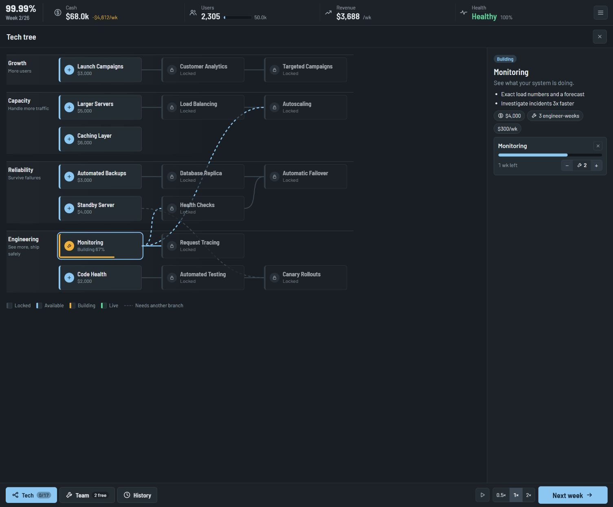

# Prototype feature migration

Source: `CS3216-Final-Project/99.9-Percent-Prototype` at commit `b3d3a552d23e2d50180d283f40e99239c2f5e79f`.

## Imported features

- Turn-based growth, server and database upgrades, caching, monitoring, redundancy, technical-debt paydown, engineer allocation, and deploy-now versus test-first decisions.
- The branching 17-node technology tree and its simulation effects.
- Four incident types, a timed crisis clock, evidence gathering, recovery actions, hints, and postmortems.
- The isometric 3D facility, equipment inspectors, management views, warning signs, and next-move advisor.
- Title screen, guided first week and first incident, pause/speed controls, keyboard shortcuts, and help/menu screens.
- Seeded runs, local save/resume, end-of-run reports, enjoyment ratings, and local prototype analytics.
- The prototype's simulation and scripted balance tests.

## Integration

The game lives in the existing `frontend/` Vite app. `src/sim/` is pure TypeScript, `src/game/` handles the store and browser persistence, and `src/components/` contains the UI and 3D scene.

Next.js entry points and deployment settings are not imported. React lazy loading replaces `next/dynamic`, Vite and TypeScript resolve the prototype's `@/` imports, and locally bundled Barlow fonts replace `next/font`. Existing lint, typecheck, test, and build scripts remain the CI entry points. Simulation tests run in Node; UI tests run in jsdom with the WebGL scene mocked.

The existing `backend/`, `shared/`, `.github/`, `.nvmrc`, environment examples, frontend API client, and Vercel configuration remain unchanged. No database migrations or server endpoints are added. Backend names and deployment URLs retain their existing values so this feature migration does not rename deployed resources.

Saves retain the prototype's storage format and keys. Browser storage is scoped to the origin, so moving between the prototype domain, a preview, and production does not transfer an existing run. Gameplay and analytics remain local; they do not use the preserved backend or database yet.

## Verification

Run the repository's usual checks in each package:

```sh
cd frontend
npm ci
npm run lint
npm run typecheck
npm test
npm run build

cd ../backend
npm ci
npm run lint
npm run typecheck
npm test
npm run db:generate
git diff --exit-code -- drizzle
```

For a browser check, run `npm run dev` in `frontend/`, then:

1. Press Play and follow or skip the tutorial; check that the 3D room renders.
2. Select equipment, launch a promotion, add a server, and open the tech tree.
3. Advance weeks and check that engineering work, cash, users, and warnings change.
4. During an incident, inspect equipment, pause/resume, choose a recovery action, and read the postmortem.
5. Refresh and continue the saved run; use Menu to start a seeded run or inspect prototype data.

## Browser verification screenshots






